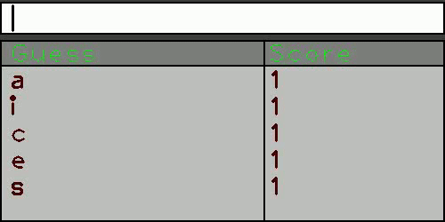
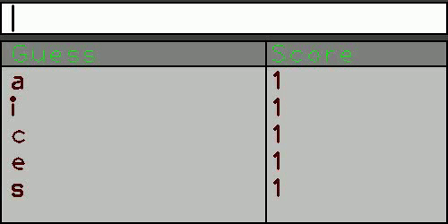

# Fuzzy_string_matching






This program calculate the Levenshtein distance of a string compared to another string (basically the minimum number of edits required to change one string into another). This kind of algorithm is used in autocompletions scripts. 

A simple demo has been written to showcase the capabilities of this algorithm (see the DEMO directory).  


To compile & run the demo :  

```
mkdir Build
cd Build
cmake ..
make
./FSM
```

Requires OPENCV3
